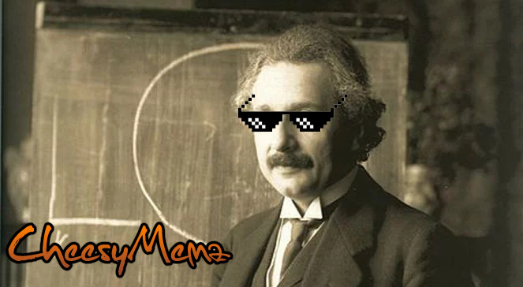
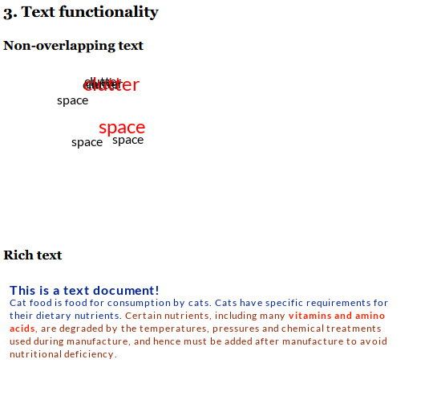

# PHP Layers

This library allows to easily create layered images using PHP and GD library. 
Previously developed as GDWrapper, was powering a rendering engine for
Map Previews in Unreal Tournament Stats Tracker:


**The project should be considered unstable for now, as I'm refactoring the code from an unhinged mess I made 10 years ago.**

## Example 1: a meme
Create a heavily outdated meme with just a few lines of code.



```php
// import image as background
$layersImg = GDW\Image::createFromFile(__DIR__ . "/eins.jpg");

// make things more THUG
$thugLayer = GDW\Layer::createFromFile(__DIR__ . "/thug.png");
// attach the layer to image, so we can move things around
$layersImg->addLayerTop($thugLayer);
// we're going to move the thug layer to a fixed position
// make selection (like CTRL+A), then drag the contents, and finally apply the result.
$thugLayer->select()->move(290, 95)->apply();

// create watermark layer
$watermarkLayer = GDW\Layer::createFromFile(__DIR__ . "/cheesymemz.png");
$layersImg->addLayerTop($watermarkLayer);
// moving the watermark to bottom left corner
$watermarkLayer->select()->move(0, GDW\IMAGE_BOTTOM)->apply();

// export the image as data URL
$dataUrl = $layersImg->getDataUrlPNG();
echo "<br/>";
```
The image is made of 3 layers, including the background. If we add an extra line, we can show all the layers as a split view:

```php
$layersImg->setComposer(new GDW\Composers\TiledComposer());

$dataUrl = $layersImg->getDataUrlPNG();
echo "<br/>";
```


## Example: rich text
The library has capability to render formatted blocks of text, and also non-overlapping text. This will be documented in future.



